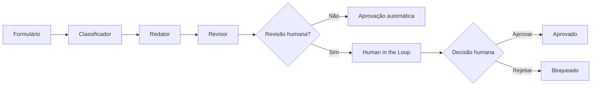

<p align="center">
  
</p>

# CorpAI — Assistente Corporativo Inteligente

Assistente corporativo com IA Generativa e automação em **n8n + Google Gemini**, criado para transformar solicitações estruturadas em comunicações profissionais, consistentes e adequadas ao contexto.

O projeto utiliza uma arquitetura em múltiplas etapas: a solicitação é **classificada**, a comunicação é **redigida**, o conteúdo é **revisado** e, quando necessário, segue para **aprovação humana (Human in the Loop)** antes de ser liberado.

> **Status:** MVP funcional e validado em cenários de aprovação automática, aprovação humana e rejeição humana.

> Projeto acadêmico desenvolvido na disciplina **Fundamentos de IA com Foco em IA Generativa**.

## Problema

Em ambientes corporativos, profissionais gastam tempo produzindo e revisando e-mails, comunicados, mensagens internas e resumos de reunião. Além do esforço repetitivo, diferentes estilos de escrita podem gerar mensagens longas, inconsistentes ou inadequadas ao público e ao canal.

O CorpAI foi criado para apoiar esse processo sem eliminar a supervisão humana em situações sensíveis.

## Solução

O CorpAI centraliza a geração de comunicações em um workflow automatizado que combina **classificação, redação, revisão, decisão de risco e validação humana**.

A solução busca reduzir retrabalho, padronizar comunicações e manter uma camada de controle humano quando o conteúdo exige maior responsabilidade.

## Como funciona

O usuário informa:

- nome do remetente;
- objetivo da comunicação;
- público;
- canal;
- informações principais;
- tom desejado.

A partir desses dados, o workflow classifica a solicitação, produz a comunicação, revisa o conteúdo e decide se é necessária intervenção humana.



## Arquitetura visual


## Camadas de IA

### 1. Classificador

Analisa a solicitação e retorna:

- tipo da comunicação;
- nível de risco;
- necessidade de revisão humana;
- justificativa da decisão.

Prompt completo: [`prompts/classificador.md`](prompts/classificador.md)

### 2. Redator

Produz a comunicação de acordo com objetivo, público, canal e tom, seguindo regras para não inventar nomes, datas, valores, prazos, responsáveis ou justificativas.

Prompt completo: [`prompts/redator.md`](prompts/redator.md)

### 3. Revisor

Compara a resposta com os dados originais, procura possíveis alucinações, valida formato, tom e assinatura e decide se a comunicação pode seguir automaticamente ou se precisa de supervisão humana.

Prompt completo: [`prompts/revisor.md`](prompts/revisor.md)

## Human in the Loop

Comunicações externas, de maior risco ou com conteúdo potencialmente sensível são encaminhadas para revisão humana.

O responsável pode:

- **APROVAR** — a comunicação é liberada;
- **REJEITAR** — a comunicação é bloqueada.

A etapa humana evita que o modelo tenha autonomia total em comunicações que exigem julgamento ou responsabilidade adicional.

## Cenários validados

O workflow foi testado ponta a ponta e validado nos seguintes comportamentos:

1. **comunicação interna de baixo risco** → classificação → redação → revisão → aprovação automática;
2. **comunicação externa ou de maior risco** → classificação → redação → revisão → Human in the Loop → aprovação humana;
3. **comunicação externa ou de maior risco** → classificação → redação → revisão → Human in the Loop → rejeição e bloqueio.

Também foram revisados os nomes dos nodes, conexões do workflow, prompts, mensagens finais e saídas de cada caminho.

## Evidências visuais

As evidências de execução serão adicionadas nesta seção após a captura final dos testes.

Está prevista a inclusão de:

- visão completa do workflow no n8n;
- formulário de entrada;
- exemplo de solicitação de baixo risco;
- exemplo de classificação e revisão;
- etapa de Human in the Loop;
- resultado de aprovação humana;
- resultado de rejeição e bloqueio.

## Tecnologias

| Tecnologia | Uso |
|---|---|
| n8n Community Edition | Orquestração e automação do workflow |
| Google Gemini | Classificação, geração e revisão de linguagem |
| Docker | Execução local do n8n |
| Prompt Engineering | Papéis, regras e restrições |
| Human in the Loop | Supervisão de comunicações sensíveis |

## Estrutura do repositório

```text
corpai-assistente-corporativo-ia/
├── README.md
├── LICENSE
├── .gitignore
├── assets/
│   └── cover.svg
├── workflow/
│   └── corpai-workflow.json
├── prompts/
│   ├── classificador.md
│   ├── redator.md
│   └── revisor.md
├── examples/
│   └── casos-de-teste.md
└── docs/
    ├── arquitetura.md
    ├── seguranca-lgpd.md
    ├── validacao.md
    └── workflow.svg
```

## Como executar

### Pré-requisitos

- Docker Desktop;
- n8n Community Edition;
- chave de API do Google Gemini.

### Passos

1. Rode o n8n Community Edition.
2. Importe [`workflow/corpai-workflow.json`](workflow/corpai-workflow.json).
3. Configure sua credencial do Google Gemini nos três nodes de modelo.
4. Confirme um modelo Gemini disponível na sua conta.
5. Execute o `Formulario CorpAI`.
6. Preencha os campos e envie.
7. Analise o caminho escolhido pelo workflow.

> O workflow público foi sanitizado e não contém API Keys, referências de credenciais locais, IDs da instância ou IDs de webhook do ambiente de desenvolvimento.

## Validação

Os cenários de teste estão documentados em [`examples/casos-de-teste.md`](examples/casos-de-teste.md) e o registro de validação está em [`docs/validacao.md`](docs/validacao.md).

A validação funcional contempla:

- entrada estruturada pelo formulário;
- classificação da solicitação;
- geração da comunicação;
- revisão automática;
- decisão sobre necessidade de supervisão humana;
- aprovação automática para cenários adequados;
- aprovação humana;
- rejeição humana e bloqueio do fluxo.

## Segurança, privacidade e LGPD

O protótipo aplica alguns princípios importantes:

- minimização de dados;
- regras explícitas contra invenção de informações;
- revisão automática do conteúdo gerado;
- supervisão humana em cenários de maior risco;
- não inclusão de credenciais no repositório público.

Em produção, ainda seriam necessários controles adicionais de autenticação, autorização, retenção de dados, logs, políticas de acesso e avaliação jurídica/organizacional relacionada à LGPD.

Veja [`docs/seguranca-lgpd.md`](docs/seguranca-lgpd.md).

## Limitações

- Modelos generativos podem produzir respostas incorretas mesmo com prompts restritivos.
- A classificação de risco depende de regras e interpretação do LLM.
- O protótipo não substitui validação jurídica, de compliance ou de segurança.
- A versão acadêmica é executada localmente e não foi projetada como serviço corporativo de produção.
- Disponibilidade e desempenho dependem do modelo Gemini utilizado.

## Principais aprendizados

O projeto demonstra, na prática, que IA Generativa pode ser incorporada a processos além de um chatbot isolado. O foco está em **orquestração de etapas, engenharia de prompts, guardrails, classificação de risco e supervisão humana**.

Também evidencia a importância de combinar automação com validação, especialmente em processos nos quais a qualidade da comunicação e o nível de risco variam conforme o contexto.

## Autor

**Sandro Ferreira**

Estudante de Engenharia da Computação e Inteligência Artificial e Automação Digital.

## Licença

Distribuído sob a licença MIT. Consulte [`LICENSE`](LICENSE).
