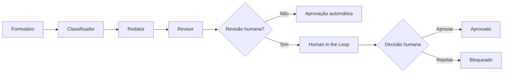

# CorpAI — Assistente Corporativo Inteligente

Assistente corporativo com IA Generativa e automação em **n8n + Google Gemini**, criado para transformar solicitações estruturadas em comunicações profissionais, consistentes e adequadas ao contexto.

O projeto utiliza uma arquitetura em múltiplas etapas: a solicitação é **classificada**, a comunicação é **redigida**, o conteúdo é **revisado** e, quando necessário, segue para **aprovação humana (Human in the Loop)** antes de ser liberado.

> Projeto acadêmico desenvolvido na disciplina **Fundamentos de IA com Foco em IA Generativa**.

## Problema

Em ambientes corporativos, profissionais gastam tempo produzindo e revisando e-mails, comunicados, mensagens internas e resumos de reunião. Além do esforço repetitivo, diferentes estilos de escrita podem gerar mensagens longas, inconsistentes ou inadequadas ao público e ao canal.

O CorpAI foi criado para apoiar esse processo sem eliminar a supervisão humana em situações sensíveis.

## Como funciona

O usuário informa:

- nome do remetente;
- objetivo da comunicação;
- público;
- canal;
- informações principais;
- tom desejado.



## Workflow


## Camadas de IA

### 1. Classificador
Analisa a solicitação e retorna tipo da comunicação, nível de risco, necessidade de revisão humana e justificativa.

### 2. Redator
Produz a comunicação de acordo com objetivo, público, canal e tom, seguindo regras para não inventar nomes, datas, valores, prazos, responsáveis ou justificativas.

### 3. Revisor
Compara a resposta com os dados originais, procura possíveis alucinações, valida formato, tom e assinatura e decide se a comunicação pode seguir automaticamente ou se precisa de supervisão humana.

## Human in the Loop

Comunicações externas, de maior risco ou com conteúdo potencialmente sensível são encaminhadas para revisão humana.

O responsável pode:

- **APROVAR** — a comunicação é liberada;
- **REJEITAR** — a comunicação é bloqueada.

## Tecnologias

| Tecnologia | Uso |
|---|---|
| n8n Community Edition | Orquestração e automação do workflow |
| Google Gemini | Classificação, geração e revisão de linguagem |
| Docker | Execução local do n8n |
| Prompt Engineering | Papéis, regras e restrições |
| Human in the Loop | Supervisão de comunicações sensíveis |

## Estrutura

```text
corpai-assistente-corporativo-ia/
├── README.md
├── LICENSE
├── .gitignore
├── workflow/
│   └── corpai-workflow.json
├── prompts/
│   ├── classificador.md
│   ├── redator.md
│   └── revisor.md
├── examples/
│   └── casos-de-teste.md
└── docs/
    ├── arquitetura.md
    ├── seguranca-lgpd.md
    └── workflow.png
```

## Como executar

1. Rode o n8n Community Edition.
2. Importe `workflow/corpai-workflow.json`.
3. Configure sua credencial do Google Gemini nos três nodes de modelo.
4. Confirme um modelo Gemini disponível na sua conta.
5. Execute o `Formulario CorpAI`.
6. Preencha os campos e envie.
7. Analise o caminho escolhido pelo workflow.

> O workflow público não contém API Keys nem credenciais pessoais.

## Casos de teste

O projeto foi validado em três comportamentos principais:

1. comunicação interna de baixo risco → aprovação automática;
2. comunicação externa → revisão humana → aprovação;
3. comunicação externa → revisão humana → rejeição.

Veja [`examples/casos-de-teste.md`](examples/casos-de-teste.md).

## Segurança, privacidade e LGPD

O protótipo aplica minimização de dados, regras contra invenção de informações, revisão automática e supervisão humana em cenários de maior risco.

Em produção, ainda seriam necessários controles adicionais de autenticação, autorização, retenção de dados, logs, políticas de acesso e avaliação jurídica/organizacional relacionada à LGPD.

Veja [`docs/seguranca-lgpd.md`](docs/seguranca-lgpd.md).

## Limitações

- Modelos generativos podem produzir respostas incorretas mesmo com prompts restritivos.
- A classificação de risco depende de regras e interpretação do LLM.
- O protótipo não substitui validação jurídica, de compliance ou de segurança.
- A versão acadêmica é executada localmente e não foi projetada como serviço corporativo de produção.
- Disponibilidade e desempenho dependem do modelo Gemini utilizado.

## Autor

**Sandro Ferreira**

Estudante de Engenharia da Computação e Inteligência Artificial e Automação Digital.

## Licença

MIT.
