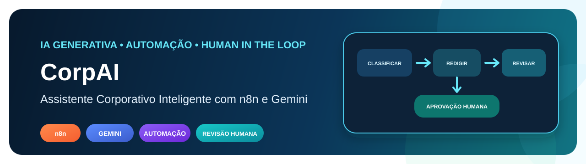
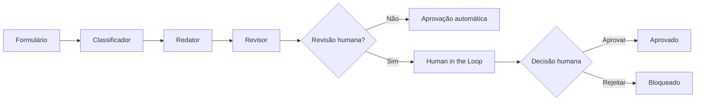
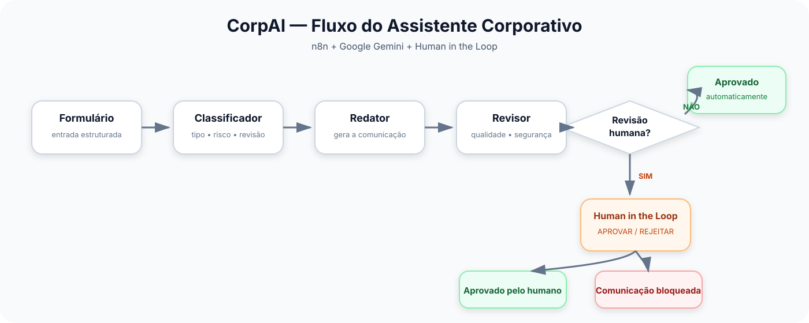
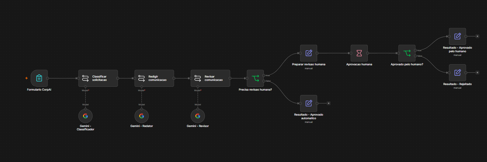
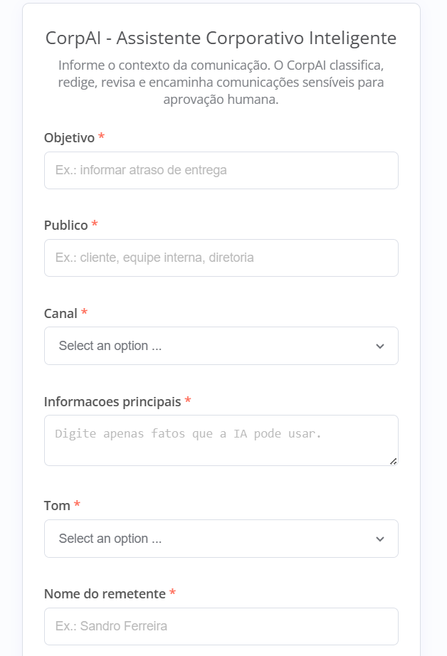
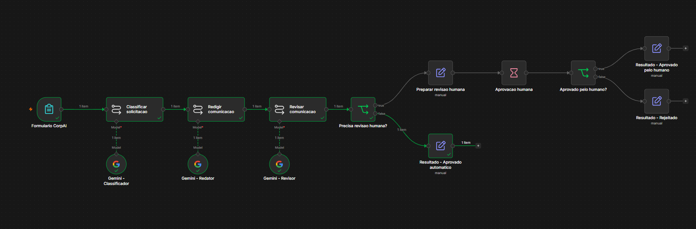
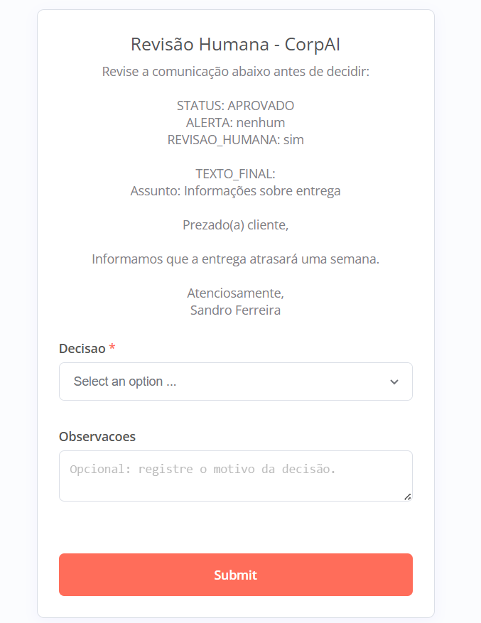
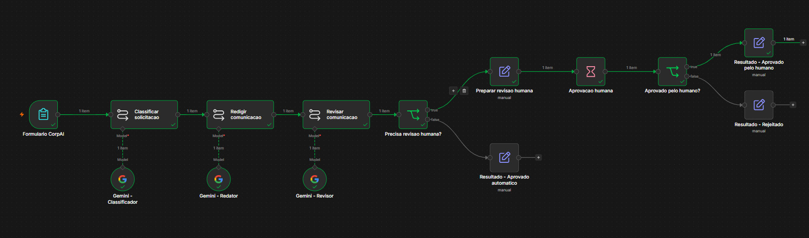
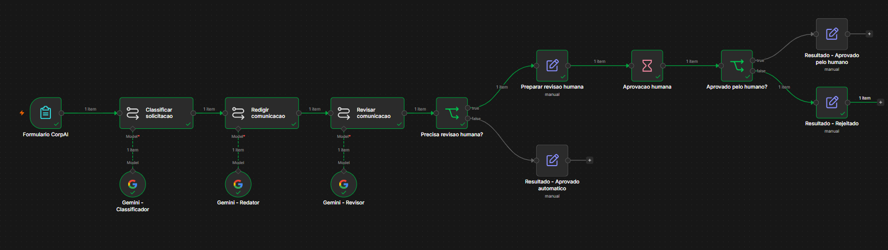

<p align="center">
  
</p>

# CorpAI — Assistente Corporativo Inteligente

Assistente corporativo com IA Generativa e automação em **n8n + Google Gemini**, criado para transformar solicitações estruturadas em comunicações profissionais, consistentes e adequadas ao contexto.

O projeto utiliza uma arquitetura em múltiplas etapas: a solicitação é **classificada**, a comunicação é **redigida**, o conteúdo é **revisado** e, quando necessário, segue para **aprovação humana (Human in the Loop)** antes de ser liberado.

> **Status:** MVP funcional, documentado e validado em cenários de aprovação automática, aprovação humana e rejeição humana.

> Projeto acadêmico desenvolvido na disciplina **Fundamentos de IA com Foco em IA Generativa**.

## Contextualização do problema

Em ambientes corporativos, profissionais gastam tempo produzindo e revisando e-mails, comunicados, mensagens internas e resumos de reunião. Além do esforço repetitivo, diferentes estilos de escrita podem gerar mensagens longas, pouco padronizadas, inconsistentes no tom ou inadequadas ao público e ao canal.

O desafio proposto pela atividade é demonstrar que IA Generativa pode ser incorporada a uma solução funcional de automação, e não utilizada apenas como um chatbot isolado.

## Solução proposta

O CorpAI centraliza a geração de comunicações em um workflow automatizado que combina **entrada estruturada, classificação, redação, revisão, decisão de risco e validação humana**.

A proposta é reduzir retrabalho, padronizar comunicações e manter uma camada de controle humano quando o conteúdo exige maior responsabilidade. O usuário fornece o contexto da comunicação e a solução interpreta esses dados para gerar uma saída adequada ao objetivo, ao público, ao canal e ao tom informado.

## Modelo de IA utilizado e justificativa

O projeto utiliza **Google Gemini** como modelo de linguagem nas etapas de classificação, redação e revisão.

A escolha foi feita porque o Gemini pode ser integrado ao workflow do n8n, permitindo que o modelo faça parte de uma automação completa em vez de funcionar apenas como uma ferramenta de conversa separada. Isso possibilita estruturar diferentes papéis para a IA, reutilizar instruções específicas em cada etapa e encaminhar o resultado automaticamente para outras decisões do fluxo.

No CorpAI, o mesmo modelo é utilizado com responsabilidades diferentes:

- **Classificador:** interpreta a solicitação e identifica tipo, risco e necessidade de revisão humana;
- **Redator:** cria a comunicação usando somente os dados fornecidos pelo usuário;
- **Revisor:** compara a resposta com os dados originais, procura inconsistências e avalia se o conteúdo pode seguir automaticamente.

## Estratégia de prompts e instruções

A estratégia adotada divide a tarefa em prompts especializados, evitando concentrar toda a responsabilidade em uma única solicitação ao LLM.

Os prompts utilizam:

- definição explícita do papel de cada etapa;
- entrada estruturada com os dados originais do usuário;
- regras para impedir invenção de nomes, datas, valores, prazos, responsáveis ou justificativas;
- formato de saída esperado para facilitar o uso do resultado nas etapas seguintes;
- critérios de classificação de risco;
- instruções para encaminhamento à supervisão humana quando necessário;
- revisão da resposta em relação às informações originais.

Essa separação busca aumentar consistência, rastreabilidade e controle sobre o comportamento do assistente.

Prompts completos:

- [`prompts/classificador.md`](prompts/classificador.md)
- [`prompts/redator.md`](prompts/redator.md)
- [`prompts/revisor.md`](prompts/revisor.md)

## Entrada estruturada

O usuário informa:

- nome do remetente;
- objetivo da comunicação;
- público;
- canal;
- informações principais;
- tom desejado.

Esses campos fornecem o contexto utilizado pela IA e ajudam a reduzir respostas genéricas ou desconectadas da solicitação original.

## Fluxo de funcionamento

A partir dos dados enviados pelo formulário, o workflow segue as seguintes etapas:

1. recebe a solicitação estruturada;
2. classifica o tipo da comunicação e o nível de risco;
3. gera a comunicação de acordo com os dados informados;
4. revisa o conteúdo gerado;
5. decide se a comunicação pode seguir automaticamente ou se precisa de revisão humana;
6. em casos sensíveis, encaminha para Human in the Loop;
7. após a decisão, libera ou bloqueia a comunicação.



## Arquitetura visual



## Camadas de IA

### 1. Classificador

Analisa a solicitação e retorna:

- tipo da comunicação;
- nível de risco;
- necessidade de revisão humana;
- justificativa da decisão.

### 2. Redator

Produz a comunicação de acordo com objetivo, público, canal e tom, seguindo regras para não inventar nomes, datas, valores, prazos, responsáveis ou justificativas.

### 3. Revisor

Compara a resposta com os dados originais, procura possíveis alucinações, valida formato, tom e assinatura e decide se a comunicação pode seguir automaticamente ou se precisa de supervisão humana.

## Human in the Loop

Comunicações externas, de maior risco ou com conteúdo potencialmente sensível são encaminhadas para revisão humana.

O responsável pode:

- **APROVAR** — a comunicação é liberada;
- **REJEITAR** — a comunicação é bloqueada.

A etapa humana evita que o modelo tenha autonomia total em comunicações que exigem julgamento ou responsabilidade adicional.

## Benefícios da solução

O protótipo demonstra benefícios como:

- redução do tempo gasto na redação e revisão de comunicações repetitivas;
- maior padronização de linguagem e tom;
- adaptação do conteúdo ao público e ao canal informado;
- separação de responsabilidades entre classificação, geração e revisão;
- redução de retrabalho;
- inserção de supervisão humana em situações de maior risco;
- possibilidade de expansão futura para outros canais e integrações corporativas.

## Principal ganho proporcionado

O principal ganho do CorpAI é transformar uma tarefa repetitiva de comunicação em um processo estruturado e automatizado, mantendo controle humano nos pontos em que a decisão não deve ficar totalmente sob responsabilidade do modelo.

Assim, a solução busca equilibrar **agilidade, padronização e responsabilidade no uso de IA Generativa**.

## Cenários validados

O workflow foi testado ponta a ponta e validado nos seguintes comportamentos:

1. **comunicação interna de baixo risco** → classificação → redação → revisão → aprovação automática;
2. **comunicação externa de risco médio** → classificação → redação → revisão → Human in the Loop → aprovação humana;
3. **comunicação externa de risco médio** → classificação → redação → revisão → Human in the Loop → rejeição e bloqueio.

Também foram revisados os nomes dos nodes, conexões do workflow, prompts, mensagens finais e saídas de cada caminho.

## Evidências visuais

As evidências abaixo registram o funcionamento real do CorpAI no n8n.

### 1. Workflow completo

Visão geral do workflow, incluindo entrada estruturada, classificação, redação, revisão, decisão de risco, aprovação automática e Human in the Loop.



### 2. Formulário de entrada

Formulário utilizado para coletar nome do remetente, objetivo, público, canal, informações principais e tom desejado.



### 3. Baixo risco — aprovação automática

Execução de uma comunicação interna classificada como baixo risco, concluída automaticamente sem necessidade de revisão humana.



### 4. Risco médio — revisão humana

Execução de uma comunicação externa para cliente, classificada como risco médio e encaminhada para revisão humana.



### 5. Human in the Loop — aprovação

Caminho de revisão humana em que a comunicação foi aprovada e liberada pelo workflow.



### 6. Human in the Loop — rejeição

Caminho de revisão humana em que a comunicação foi rejeitada e bloqueada pelo workflow.



## Tecnologias e ferramentas utilizadas

| Tecnologia | Uso |
|---|---|
| n8n Community Edition | Orquestração e automação do workflow |
| Google Gemini | Classificação, geração e revisão de linguagem |
| Docker | Execução local do n8n |
| Prompt Engineering | Papéis, regras e restrições |
| Human in the Loop | Supervisão de comunicações sensíveis |

## Estrutura do repositório

```text
corpai-assistente-corporativo-ia/
├── README.md
├── LICENSE
├── .gitignore
├── assets/
│   └── cover.svg
├── workflow/
│   └── corpai-workflow.json
├── prompts/
│   ├── classificador.md
│   ├── redator.md
│   └── revisor.md
├── examples/
│   └── casos-de-teste.md
└── docs/
    ├── arquitetura.md
    ├── seguranca-lgpd.md
    ├── validacao.md
    ├── workflow.svg
    └── evidencias/
        ├── 01-workflow-completo.png
        ├── 02-formulario-entrada.png
        ├── 03-baixo-risco-aprovacao-automatica.png
        ├── 04-risco-medio-revisao-humana.png
        ├── 05-human-in-the-loop-aprovacao.png
        └── 06-human-in-the-loop-rejeicao.png
```

## Como executar

### Pré-requisitos

- Docker Desktop;
- n8n Community Edition;
- chave de API do Google Gemini.

### Passos

1. Rode o n8n Community Edition.
2. Importe [`workflow/corpai-workflow.json`](workflow/corpai-workflow.json).
3. Configure sua credencial do Google Gemini nos três nodes de modelo.
4. Confirme um modelo Gemini disponível na sua conta.
5. Execute o `Formulario CorpAI`.
6. Preencha os campos e envie.
7. Analise o caminho escolhido pelo workflow.

> O workflow público foi sanitizado e não contém API Keys, referências de credenciais locais, IDs da instância ou IDs de webhook do ambiente de desenvolvimento.

## Link da solução

O protótipo foi desenvolvido e executado localmente no **n8n Community Edition**. Por esse motivo, no estado atual, não há um link público permanente da aplicação em execução.

O workflow está disponível neste repositório para importação e execução local:

[`workflow/corpai-workflow.json`](workflow/corpai-workflow.json)

## Validação funcional

Os cenários de teste estão documentados em [`examples/casos-de-teste.md`](examples/casos-de-teste.md) e o registro de validação está em [`docs/validacao.md`](docs/validacao.md).

A validação funcional contempla:

- entrada estruturada pelo formulário;
- classificação da solicitação;
- geração da comunicação;
- revisão automática;
- decisão sobre necessidade de supervisão humana;
- aprovação automática para cenários adequados;
- aprovação humana;
- rejeição humana e bloqueio do fluxo.

## Riscos, privacidade, LGPD e uso responsável

O projeto considera que a adoção de IA Generativa em processos corporativos envolve riscos que precisam ser avaliados.

### Privacidade e LGPD

O usuário deve inserir apenas informações necessárias para a geração da comunicação. Em um ambiente corporativo real, seria necessário definir políticas de tratamento, retenção e acesso aos dados, além de avaliar a base legal aplicável ao tratamento de dados pessoais.

O protótipo aplica o princípio de minimização de dados e não inclui credenciais no repositório público.

### Alucinações

Modelos generativos podem produzir informações incorretas ou adicionar detalhes que não estavam presentes na entrada. Para reduzir esse risco, os prompts determinam que o modelo utilize somente os dados fornecidos, e o resultado passa por uma etapa de revisão antes da liberação.

### Vieses

As respostas do modelo podem refletir vieses presentes nos dados de treinamento ou interpretar de maneira inadequada determinados contextos, públicos ou tons de comunicação. Por isso, respostas sensíveis não devem ser tratadas como decisões definitivas e podem exigir revisão humana.

### Segurança da informação

Informações confidenciais, credenciais, dados sensíveis ou conteúdos críticos não devem ser expostos desnecessariamente ao modelo. Em uma implantação real, seriam necessários controles de autenticação, autorização, logs, segregação de acesso e políticas corporativas para uso de IA.

### Supervisão humana

O Human in the Loop é utilizado justamente para limitar a autonomia da IA nos casos em que uma comunicação externa, sensível ou de maior risco exige julgamento humano.

Veja também [`docs/seguranca-lgpd.md`](docs/seguranca-lgpd.md).

## Limitações

- Modelos generativos podem produzir respostas incorretas mesmo com prompts restritivos.
- A classificação de risco depende de regras e interpretação do LLM.
- O modelo pode reproduzir vieses ou interpretar incorretamente determinados contextos.
- O protótipo não substitui validação jurídica, de compliance ou de segurança.
- A versão acadêmica é executada localmente e não foi projetada como serviço corporativo de produção.
- Disponibilidade e desempenho dependem do modelo Gemini utilizado.
- O workflow não possui, no estado atual, um ambiente público permanente para demonstração por link.

## Principais aprendizados

O projeto demonstra, na prática, que IA Generativa pode ser incorporada a processos além de um chatbot isolado. O foco está em **orquestração de etapas, engenharia de prompts, guardrails, classificação de risco e supervisão humana**.

Também evidencia a importância de combinar automação com validação, especialmente em processos nos quais a qualidade da comunicação e o nível de risco variam conforme o contexto.

## Aderência aos requisitos da atividade

| Requisito | Implementação no CorpAI |
|---|---|
| Entrada estruturada de informações | Formulário com remetente, objetivo, público, canal, informações principais e tom |
| Uso de LLM | Google Gemini |
| Prompt/instruções definidos | Prompts separados para Classificador, Redator e Revisor |
| Fluxo automatizado/agente | Workflow no n8n |
| Saída contextualizada | Comunicação gerada de acordo com objetivo, público, canal e tom |
| Supervisão humana | Human in the Loop para comunicações sensíveis ou de maior risco |
| Workflow construído | Arquivo JSON disponível em `workflow/` |
| README.md | Documentação do problema, solução, ferramentas, fluxo, prompts e uso |
| Evidências funcionando | 6 capturas reais disponíveis em `docs/evidencias/` |
| Link da solução | Execução local; workflow compartilhado no repositório |

## Pendências para a entrega acadêmica

O protótipo, o workflow, o README e as evidências visuais estão concluídos. Para finalizar a entrega da disciplina, ainda faltam:

- preparar e entregar o documento da parte teórica no formato solicitado pela instituição, caso seja exigido como arquivo separado;
- gravar o vídeo pitch de até 4 minutos;
- publicar o vídeo em uma plataforma acessível por link;
- conferir o acesso ao link antes do envio final.

## Autor

**Sandro Ferreira**

Estudante de Engenharia da Computação e Inteligência Artificial e Automação Digital.

## Licença

Distribuído sob a licença MIT. Consulte [`LICENSE`](LICENSE).
